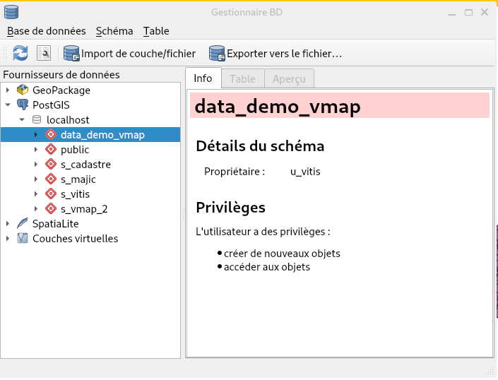

## Sommaire
- [QGIS](#qgis)
  - [Installer QGIS Desktop](#installer-qgis-desktop)
  - [Ajouter des couches dans vMap](#ajouter-des-couches-dans-vmap)

# QGIS

## Installer QGIS Desktop
```bash
sudo apt install gnupg software-properties-common

sudo mkdir -m755 -p /etc/apt/keyrings

sudo wget -O /etc/apt/keyrings/qgis-archive-keyring.gpg https://download.qgis.org/downloads/qgis-archive-keyring.gpg

sudo apt update

sudo apt install qgis qgis-plugin-grass
```

## Ajouter des couches dans vMap 
* Lancez QGIS Desktop ([Installer QGIS](#installer-qgis-desktop-))
* Créez ou ouvrez la/les couche(s) que vous voulez dans vMap
* Dans l'onglet explorateur, clique droit sur `PostgreSQL`
* Nouvelle connexion 
* ```Nom: localhost, Hôte: 127.0.0.1, Port: 5432, Base de données: vmap```
* Entrez vos identifiants de votre base de données
* Aller dans `Base de données`
* `DB Manager`
* `PostGIS > localhost > sélectionnez data_demo_vmap`
* `Import de couche/fichier`
* Sélectionnez la couche à importer, mettez les paramètres que vous voulez (ne mettez <warning>pas de majucule ou de caractères spéciaux</warning> dans les noms de tables à par `_`).

