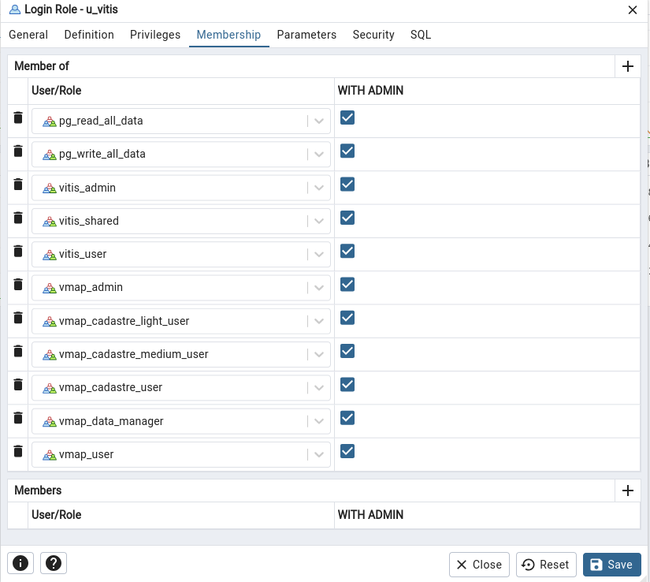

<style>
    erreur {
        color:red;
        background-color: #3d3c3d;
        border-radius: 5px;

        padding-bottom: 2px;
        padding-top: 2px;
        padding-left: 3px;
        padding-right: 3px;
    }

    sousTitre {
        color: white;
        font-size: 1.25em;
        text-decoration: white underline;
    }

    warning {
        color:white;
        background-color: #c07c2c;
        border-radius: 5px;
        text-decoration: white underline;

        padding-bottom: 2px;
        padding-top: 2px;
        padding-left: 3px;
        padding-right: 3px;
    }
</style>

# vMap
## 1. Prérequis :
- **Apache 2** ([documentation](./doc_serveur_web.md) dans le repo)
- **Postgresql** ([documentation](./doc_postgresql.md) dans le repo)
- **PostGis** :
    - `sudo apt-get install postgresql-<latestVersion>-postgis-<latestVersion>`


## 2. Installation :
 - Téléchargez vMap sur [vStore](https://vstore.veremes.net/vstore/login).
 - Dans le `dependencies.json` changez :
    - `"HOSTNAME": "127.0.0.1"`
    - `POSTGRES_DB": "vmap"`
    - `"POSTGRES_HOST": "127.0.0.1"`
    - `"POSTGRES_PASSWORD": "<Mot de passe postgres>"`
    - `"POSTGRES_PORT": 5432`
    - `"POSTGRES_USER": "postgres"`
 - Créez un script bash et copiez ceci :
```bash
#!bin/bash

sudo rm -rf /var/www/vmap
sudo ./installer

echo "[v3_req]" > /tmp/openssl.cnf 
echo "basicConstraints=CA:FALSE" >> /tmp/openssl.cnf

rm /etc/ssl/private/selfsigned.key
rm /etc/ssl/certs/selfsigned.crt

sudo openssl req -x509 -nodes -days 365 -newkey rsa:2048 \
                 -keyout /etc/ssl/private/selfsigned.key \
                 -out /etc/ssl/certs/selfsigned.crt \
                 -subj "/C=FR/ST=France/L=Ploufragan/O=Organization/CN=localhost" \
                 -extensions v3_req -config /tmp/openssl.cnf

rm /tmp/openssl.cnf                

echo "
<VirtualHost *:80>
    ServerName localhost
    DocumentRoot /var/www/vmap

    # Redirection vers HTTPS
    Redirect permanent / https://localhost/vmap
</VirtualHost>
<VirtualHost *:443>
    ServerName localhost
    DocumentRoot /var/www/vmap

    SSLEngine on
    SSLCertificateFile /etc/ssl/certs/selfsigned.crt
    SSLCertificateKeyFile /etc/ssl/private/selfsigned.key

    <Directory /var/www/vmap>
        AllowOverride All
        Require all granted
    </Directory>
</VirtualHost>
" >> /etc/apache2/sites-available/vm_app_vmap.conf

sudo chown -R www-data:www-data /var/www/vmap
sudo chmod -R 755 /var/www/vmap

sudo chmod 644 /etc/ssl/certs/selfsigned.crt
sudo chmod 600 /etc/ssl/private/selfsigned.key

sudo a2ensite vm_app_vmap.conf
sudo a2enmod ssl
sudo systemctl restart avahi-daemon
sudo systemctl restart apache2
sudo apache2ctl configtest
```
- Lancez ce script dans le même dossier où est l'`installer` de base de vMap. (Ce script installe vMap, créer un certificat SSL valide pour le local et l'active).
- `sudo systemctl restart postgresql`

\
**_Les identifiants de base sont : admin, admin_**
\
(à changer dans `dependencies.json` tout en bas, puis relancez le script d'installation)

# Testez dans [https://localhost/vmap](https://localhost/vmap) ! 
Si problème, supprimez le schéma vmap dans pgAdmin ainsi que tous les rôles liés à vMap (vmap_..., vitis_..., u_vitis et <warning>aucun autre !</warning>). 
<br>
Relancez le script bash ensuite. 


# Rendre vMap fonctionnel
## 1. Problème de droits :
* <sousTitre> Si les couches de base de s'affiche pas, ou qu'il y a des problèmes, comme : </sousTitre>
    * <erreur>Erreur pendant la requête</erreur>
    * <erreur>Vous n'avez pas accès</erreur>
    * Etc...

* <sousTitre>Ajoutez les droits à votre utilisateur : </sousTitre>
    * Lancez pgAdmin ([Installer pgAdmin](#installer-pgadmin-desktop-))
    * Connectez vous à votre base de donnée localhost
    * Allez dans les `Login/Group Roles`
    * Cliquez droit sur l'utilisateur `u_vitis`
    * Allez dans `Properties` puis `Membreship`
    * Ajoutez tous les droits un par un qui commence par `vmap_` ou `vitis_`
    * Ainsi que `pg_read_all_data` et `pg_write_all_data`
    * Cliquez sur save.
  


## 2. Ajouter des couches dans vMap :
Allez voir la documentation [QGIS](./doc_qgis.md)

## 3. Pour plus d'info sur vMap :
Vidéo tuto vMap faites par RnPVision. (contactez nous)

## Installer pgAdmin Desktop :
```bash
curl -fsS https://www.pgadmin.org/static/packages_pgadmin_org.pub | sudo gpg --dearmor -o /usr/share/keyrings/packages-pgadmin-org.gpg

sudo sh -c 'echo "deb [signed-by=/usr/share/keyrings/packages-pgadmin-org.gpg] https://ftp.postgresql.org/pub/pgadmin/pgadmin4/apt/$(lsb_release -cs) pgadmin4 main" > /etc/apt/sources.list.d/pgadmin4.list && apt update'

sudo apt update

sudo apt install pgadmin4-desktop
```

## Installer QGIS Desktop :
Allez voir la documentation [QGIS](./doc_qgis.md)