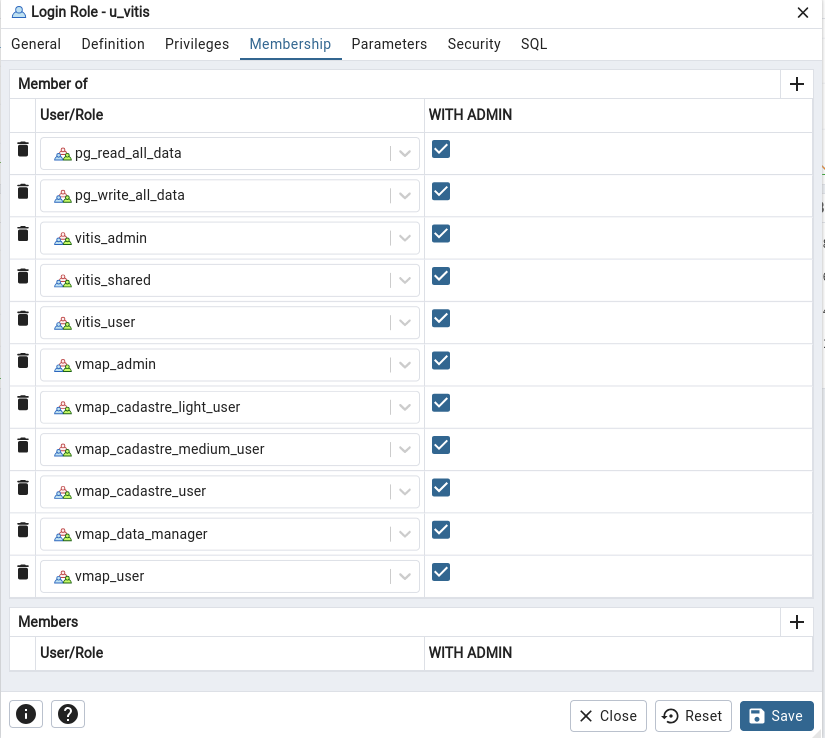

<style>
    erreur {
        color:red;
        background-color: #3d3c3d;
        border-radius: 5px;

        padding-bottom: 2px;
        padding-top: 2px;
        padding-left: 3px;
        padding-right: 3px;
    }

    sousTitre {
        color: white;
        font-size: 1.25em;
        text-decoration: white underline;
    }

    warning {
        color:white;
        background-color: #c07c2c;
        border-radius: 5px;
        text-decoration: white underline;

        padding-bottom: 2px;
        padding-top: 2px;
        padding-left: 3px;
        padding-right: 3px;
    }
</style>
# Rendre vMap fonctionnel
## 1. Problème de droits :
* <sousTitre> Si les couches de base de s'affiche pas, ou qu'il y a des problèmes, comme : </sousTitre>
    * <erreur>Erreur pendant la requête</erreur>
    * <erreur>Vous n'avez pas accès</erreur>
    * Etc...

* <sousTitre>Ajouter les droits à votre utilisateur : </sousTitre>
    * Lancez pgAdmin ([Installer pgAdmin](#installer-pgadmin-desktop-))
    * Connecter vous à votre base de donnée localhost
    * Aller dans les `Login/Group Roles`
    * Clique droit sur l'utilisateur `u_vitis`
    * Aller dans `Properties` puis `Membreship`
    * Ajouter tous les droits un par un qui comme par `vmap_` ou `vitis_`
    * Ainsi que `pg_read_all_data` et `pg_write_all_data`
    * Cliquez sur save.
  


## 2. Ajouter des couches dans vMap :
* Lancez QGIS Desktop ([Installer QGIS](#installer-qgis-desktop-))
* Créez ou ouvrez la/les couche(s) que vous voulez dans vMap
* Dans l'onglet explorateur, clique droit sur `PostgreSQL`
* Nouvelle connexion 
* ```Nom: localhost, Hôte: 127.0.0.1, Port: 5432, Base de données: vmap```
* Entrez vos identifiants de votre base de données
* Aller dans `Base de données`
* `DB Manager`
* `PostGIS > localhost > sélectionnez data_demo_vmap`
* `Import de couche/fichier`
* Sélectionner la couche à importer, mettez les paramètre que vous voulez (ne mettez <warning>pas de majucule ou de caractères spéciaux</warning> dans les noms de tables à par `_`).


## 3. Pour plus d'info sur vMap :
Vidéo tuto vMap que j'ai fais

## Installer pgAdmin Desktop :
```bash
curl -fsS https://www.pgadmin.org/static/packages_pgadmin_org.pub | sudo gpg --dearmor -o /usr/share/keyrings/packages-pgadmin-org.gpg

sudo sh -c 'echo "deb [signed-by=/usr/share/keyrings/packages-pgadmin-org.gpg] https://ftp.postgresql.org/pub/pgadmin/pgadmin4/apt/$(lsb_release -cs) pgadmin4 main" > /etc/apt/sources.list.d/pgadmin4.list && apt update'

sudo apt update

sudo apt install pgadmin4-desktop
```

## Installer QGIS Desktop :
```bash
sudo apt install gnupg software-properties-common

sudo mkdir -m755 -p /etc/apt/keyrings

sudo wget -O /etc/apt/keyrings/qgis-archive-keyring.gpg https://download.qgis.org/downloads/qgis-archive-keyring.gpg

sudo apt update

sudo apt install qgis qgis-plugin-grass
```